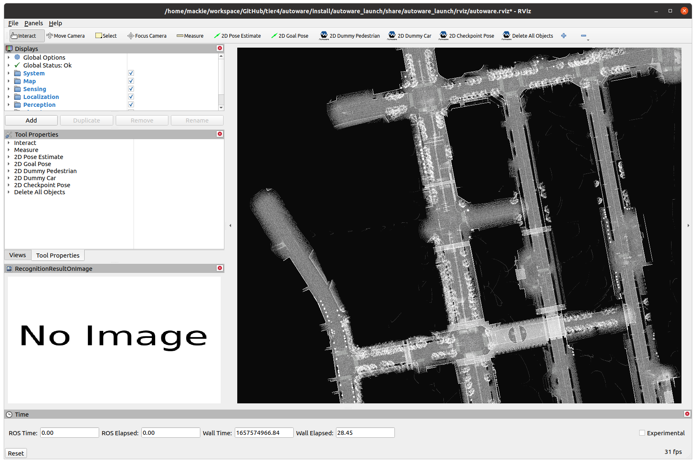
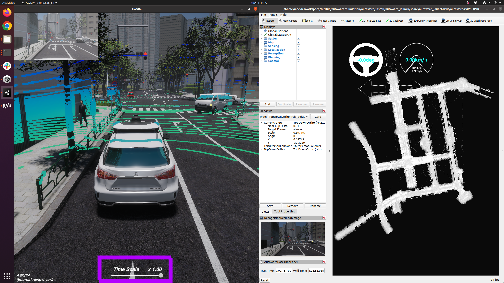
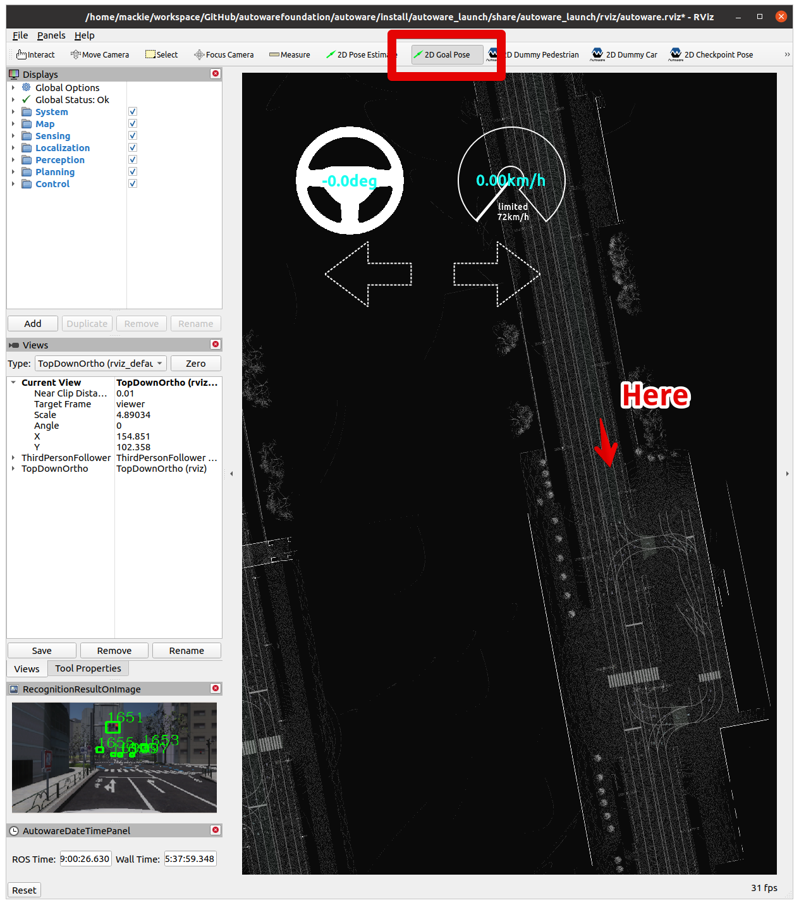

# AWSIM simulation


## A. Preparation

   Before trying AWSIM simulation, you have to once exit the Docker container by `exit` command.

   Required PC specs
   - CPU: 6cores and 12thread or higher
   - GPU: RTX2080Ti or higher

   Download AWSIM binary
   ```bash
   sudo apt install libarchive-tools -y
   cd $HOME
   wget -qO- https://github.com/tier4/AWSIM/releases/download/v1.1.0/AWSIM_v1.1.0.zip | bsdtar -xvf-
   chmod +x ./AWSIM_v1.1.0/AWSIM_demo.x86_64
   ```
   
   Download a map
   ```bash
   wget -qO- https://github.com/tier4/AWSIM/releases/download/v1.1.0/nishishinjuku_autoware_map.zip | bsdtar -xvf-
   mv nishishinjuku_autoware_map ~/autoware_map
   ```

## B. Run simulation

   #### Terminal 1

   Launch a Docker container
   ```bash
   rocker --nvidia --x11 --user --privileged --network=host --volume $HOME/autoware_map --volume /tmp -- ghcr.io/tier4/online:humble-awsim-stable-prebuilt-cuda
   ```

   Launch Autoware
   ```bash
   export ROS_LOCALHOST_ONLY=1
   export RMW_IMPLEMENTATION=rmw_cyclonedds_cpp
   export RCUTILS_COLORIZED_OUTPUT=1
   
   source /autoware/install/setup.bash
   ros2 launch autoware_launch e2e_simulator.launch.xml \
   vehicle_model:=sample_vehicle \
   sensor_model:=awsim_sensor_kit \
   map_path:=$HOME/autoware_map/nishishinjuku_autoware_map
   ```

   If you feel it consumes memory too much, you can turn off Displays > Map >  PointCloudMap on Rviz panel.
   

   You can see the map appears.
   

   #### Terminal 2

   Launch a Docker container
   ```bash
   rocker --nvidia --x11 --user --privileged --network=host --volume $HOME/autoware_map --volume $HOME/AWSIM_v1.1.0 --volume /tmp -- ghcr.io/tier4/online:humble-awsim-stable-prebuilt-cuda
   ```

   Launch AWSIM
   ```bash
   export ROS_LOCALHOST_ONLY=1
   export RMW_IMPLEMENTATION=rmw_cyclonedds_cpp
   export RCUTILS_COLORIZED_OUTPUT=1

   cd $HOME
   source /autoware/install/setup.bash
   ./AWSIM_v1.1.0/AWSIM_demo.x86_64
   ```

   You can see unity is launched.
   

## C. Enjoy self-Driving simulation

   1. Launch AWSIM and Autoware according to the steps described earlier in this document.
   
   
   2. The Autoware will automatically set its pose estimation as presented below.
   
   
   3. Set the navigation goal for the vehicle.
   
   
   
   4. Optionally, you can define an intermediate point through which the vehicle will travel on its way to the destination.
   
   The generated path can be seen on the image below.
   
   
   5. Enable self-driving.
   
   To make the vehicle start navigating please engage it's operation using the command below.
   
   ```
   source /autoware/install/setup.bash
   ros2 topic pub /autoware/engage autoware_auto_vehicle_msgs/msg/Engage '{engage: True}' -1
   ```
   
   
   
   Finally, the self-driving simulation should start!
