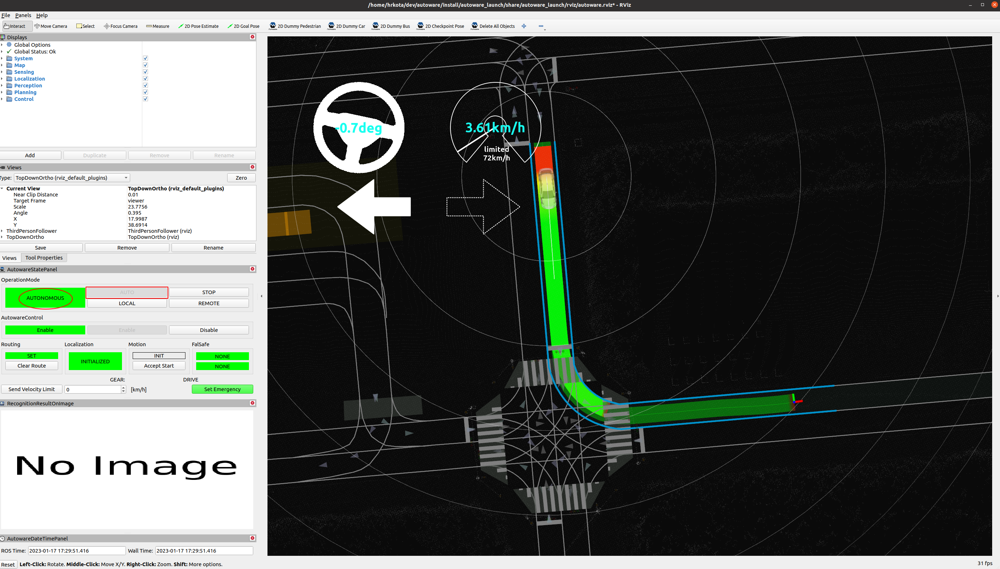

# Planning simulation

## Preparation

Download and unpack a sample map.

- You can also download [the map](https://drive.google.com/file/d/1499_nsbUbIeturZaDj7jhUownh5fvXHd/view?usp=sharing) manually.

```bash
gdown -O ~/autoware_map/ 'https://docs.google.com/uc?export=download&id=1499_nsbUbIeturZaDj7jhUownh5fvXHd'
unzip -d ~/autoware_map ~/autoware_map/sample-map-planning.zip
```

## Basic simulations

### Lane driving scenario

#### 1. Launch Autoware

```bash
source /autoware/install/setup.bash
ros2 launch autoware_launch planning_simulator.launch.xml map_path:=$HOME/autoware_map/sample-map-planning vehicle_model:=sample_vehicle sensor_model:=sample_sensor_kit
```

Note that you cannot use `~` instead of `$HOME` here.
If `~` is used, the map will fail to load.


#### 2. Set an initial pose for the ego vehicle


a) Click the `2D Pose estimate` button in the toolbar, or hit the `P` key.

b) In the 3D View pane, click and hold the left-mouse button, and then drag to set the direction for the initial pose. An image representing the vehicle should now be displayed.


Remember to set the initial pose of the car in the same direction as the lane.
To confirm the direction of the lane, check the arrowheads displayed on the map.

#### 3. Set a goal pose for the ego vehicle

a) Click the `2D Goal Pose` button in the toolbar, or hit the `G` key.

b) In the 3D View pane, click and hold the left-mouse button, and then drag to set the direction for the goal pose. If done correctly, you will see a planned path from initial pose to goal pose.


#### 4. Start the ego vehicle

Now you can start the ego vehicle driving by clicking the `AUTO` button on `OperationMode` in `AutowareStatePanel`.
Alteratively, you can manually start the vehicle by running the following command:

```bash
source /autoware/install/setup.bash
ros2 service call /api/operation_mode/change_to_autonomous autoware_adapi_v1_msgs/srv/ChangeOperationMode {}
```

After that, you can see `AUTONOMOUS` sign on `OperationMode` and `AUTO` button is grayed out.



